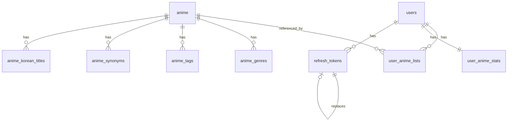

# Database Schema Overview

이 문서는 `backend/sql_scripts` 기준으로 현재 MyAniTrack V2 데이터베이스 구조를 정리한 문서입니다.

- 데이터베이스명: `myanitrack_v2`
- 기준 파일:
  - `table_creation.sql`
  - `anime_korean_titles.sql`
  - `refresh_tokens.sql`
  - `user_anime_stats.sql`
  - `user_anime_stats_fix1.sql`
  - `user_anime_total.sql`

## 개요

현재 스키마는 크게 아래 영역으로 나뉩니다.

- 애니 메타데이터
- 유저 및 인증
- 유저 애니 리스트
- 추천/통계 캐시
- 보조 데이터

핵심 설계 방향은 다음과 같습니다.

- 애니 기본 데이터는 `anime`를 중심으로 정규화되어 있음
- 유저의 실제 기록은 `user_anime_lists`에 저장됨
- 추천/분석용 집계 데이터는 `user_anime_stats`에 캐시됨
- 로그인 세션 유지는 `refresh_tokens`로 관리됨

## 테이블 목록

### 1. `anime`
애니메이션의 기본 메타데이터를 저장하는 메인 테이블입니다.

주요 컬럼:

- `id`: 내부 PK
- `anilist_id`: AniList 원본 고유 ID, UNIQUE
- `title_romaji`, `title_english`, `title_native`, `title_user_preferred`: 다국어 제목
- `description`: 설명
- `episodes`: 총 에피소드 수
- `duration`: 1화당 분 단위 러닝타임
- `season`, `season_year`: 방영 시즌/연도
- `format`, `status`, `source`: 작품 형식/상태/원작 정보
- `country_of_origin`: 원산 국가
- `is_adult`: 성인물 여부
- `average_score`, `mean_score`, `popularity`, `favourites`: 작품 지표
- `cover_image_large`, `cover_image_extra_large`, `banner_image`: 이미지
- `site_url`: 외부 링크
- `source_updated_at`: 외부 원본 기준 갱신 시각
- `created_at`, `updated_at`: 내부 생성/수정 시각

역할:

- 모든 애니 조회 API의 기준 테이블
- 추천 시스템 후보군 테이블
- 장르, 태그, 동의어, 한국어 제목 테이블과 연결되는 중심 테이블

### 2. `anime_genres`
애니와 장르의 다대다 성격을 단순화한 매핑 테이블입니다.

주요 컬럼:

- `anime_id`
- `genre`

특징:

- PK: `(anime_id, genre)`
- `anime.id` 참조
- 애니 삭제 시 CASCADE

역할:

- 장르 필터 목록 API
- 장르 기반 추천 계산
- 유저 취향 통계 계산

### 3. `anime_tags`
애니 태그와 태그 랭크 정보를 저장합니다.

주요 컬럼:

- `anime_id`
- `tag_name`
- `rank_value`
- `is_spoiler`

특징:

- PK: `(anime_id, tag_name)`
- `anime.id` 참조

역할:

- 상세 페이지 태그 노출
- 향후 세밀한 콘텐츠 기반 추천 확장 포인트

### 4. `anime_synonyms`
애니의 대체 제목/동의어를 저장합니다.

주요 컬럼:

- `anime_id`
- `synonym`

특징:

- PK: `(anime_id, synonym)`
- `anime.id` 참조

역할:

- 검색 개선
- 대체 제목 노출

### 5. `anime_korean_titles`
애니의 한국어 제목 정보를 별도 관리하는 테이블입니다.

주요 컬럼:

- `id`
- `anime_id`
- `title`
- `subtitle`
- `full_title`: `title + subtitle` 기반 생성 컬럼
- `is_primary`: 대표 한국어 제목 여부
- `created_at`, `updated_at`

인덱스/제약:

- UNIQUE: `(anime_id, title, subtitle)`
- INDEX: `title`
- INDEX: `full_title`
- `anime.id` 참조

역할:

- 한국어 제목 표시
- 한국어 검색
- 한국어 제목 우선 fallback 처리

### 6. `users`
서비스 사용자 계정 테이블입니다.

주요 컬럼:

- `id`
- `email`: UNIQUE
- `username`: UNIQUE
- `password_hash`
- `profile_image_url`
- `bio`
- `created_at`, `updated_at`
- `anime_list_count`: 유저가 추가한 애니 수

역할:

- 회원가입/로그인 기준 테이블
- 프로필 노출 정보 저장
- 친구 기능, 유저 리스트, 추천 통계의 기준 유저 엔터티

참고:

- `anime_list_count`는 `user_anime_total.sql`에서 추가된 컬럼입니다.

### 7. `user_anime_lists`
유저가 자신의 리스트에 추가한 애니 기록의 원본 테이블입니다.

주요 컬럼:

- `id`
- `user_id`
- `anime_id`
- `status`: 예. `planned`, `watching`, `completed`, `paused`, `dropped`
- `score`: 유저 평점
- `progress`: 시청한 에피소드 수
- `started_at`, `completed_at`
- `notes`
- `created_at`, `updated_at`

제약:

- UNIQUE: `(user_id, anime_id)`
- `users.id` 참조
- `anime.id` 참조

역할:

- 유저 개인 리스트의 원본 데이터
- 시청 상태/점수/진행도 저장
- 추천 통계 재계산의 기준 데이터

### 8. `user_anime_stats`
추천 시스템과 통계 페이지에서 바로 사용할 수 있는 유저별 집계 캐시 테이블입니다.

주요 컬럼:

- `user_id`: PK, `users.id` 참조
- `total_count`
- `completed_count`
- `watching_count`
- `dropped_count`
- `total_watched_episodes`
- `total_watch_minutes`: 분 단위 누적 시청 시간
- `avg_score`
- `favorite_genre`
- `favorite_release_period`
- `genre_distribution`: JSON
- `genre_watch_minutes`: JSON
- `genre_avg_score`: JSON
- `release_year_distribution`: JSON
- `avg_release_year`
- `score_distribution`: JSON
- `preference_summary`
- `recommendation_context`
- `top_watched_genre_top_anime`: JSON
- `top_rated_genre_top_anime`: JSON
- `updated_at`

역할:

- 무거운 집계를 매번 하지 않도록 추천용 캐시 제공
- 취향 분석 UI의 데이터 소스
- 추천 API의 입력 컨텍스트

JSON 컬럼 예시:

- `genre_distribution`: `{ "Action": 10, "Drama": 5 }`
- `genre_watch_minutes`: `{ "Action": 2400, "Drama": 1200 }`
- `genre_avg_score`: `{ "Action": 8.2, "Drama": 9.0 }`
- `release_year_distribution`: `{ "2010": 5, "2020": 8 }`
- `score_distribution`: `{ "7": 3, "8": 9, "9": 4 }`

추가 컬럼 설명:

- `top_watched_genre_top_anime`: 가장 많이 본 장르의 대표 애니 5개
- `top_rated_genre_top_anime`: 평균 평점이 가장 높은 장르의 대표 애니 5개

### 9. `refresh_tokens`
로그인 세션의 refresh token 저장 테이블입니다.

주요 컬럼:

- `id`
- `user_id`
- `token_hash`
- `jti`
- `device_type`: `web | android | ios | unknown`
- `device_name`
- `user_agent`
- `ip_address`
- `issued_at`
- `expires_at`
- `revoked_at`
- `revoke_reason`
- `replaced_by_token_id`
- `created_at`, `updated_at`

역할:

- 멀티 디바이스 로그인 관리
- refresh token rotation
- 기기별 로그아웃 / 전체 로그아웃 지원

## 테이블 관계

## 데이터 흐름

### 애니 데이터 흐름

- 외부 원본 데이터가 `anime`에 적재됨
- 장르/태그/동의어/한국어 제목은 각 보조 테이블에 분리 저장
- 목록, 검색, 상세 API는 이 구조를 기반으로 응답 생성

### 유저 리스트 흐름

- 유저가 애니를 리스트에 추가/수정/삭제
- 원본 기록은 `user_anime_lists`에 저장
- `users.anime_list_count`가 보조 집계로 유지됨
- 추천 관련 변경이 있으면 `user_anime_stats` 재계산

### 추천/통계 흐름

- `user_anime_lists` 기반으로 유저 취향 집계
- 집계 결과를 `user_anime_stats`에 upsert
- 추천 API는 원본 리스트 전체를 매번 계산하지 않고 `user_anime_stats`를 우선 사용

### 인증 흐름

- 회원가입/로그인 시 `users`와 `refresh_tokens` 사용
- access token은 서버 서명 기반 검증
- refresh token은 DB 해시 저장 및 회전 처리

## 현재 스크립트 기준 특징

- 애니 데이터와 유저 데이터가 명확히 분리되어 있음
- 유저 리스트 원본과 추천 캐시가 분리되어 있음
- JSON 컬럼을 적극 활용해 추천용 요약 데이터를 저장함
- 한국어 제목을 별도 테이블로 관리해 검색과 표시를 개선함
- refresh token 저장 구조가 모바일 앱 로그인까지 고려하고 있음

## 스크립트에 아직 없는 항목

현재 `sql_scripts` 폴더 기준으로는 아래 테이블이 포함되어 있지 않습니다.

- `friend_requests`
- `friendships`

즉, 친구 기능이 실제 DB에 이미 반영되어 있더라도, 현재 문서 기준의 소스 오브 트루스는 `sql_scripts` 안에는 아직 저장되지 않은 상태일 수 있습니다. 친구 기능을 스키마 문서의 정식 일부로 관리하려면 별도 SQL 파일 추가가 필요합니다.
